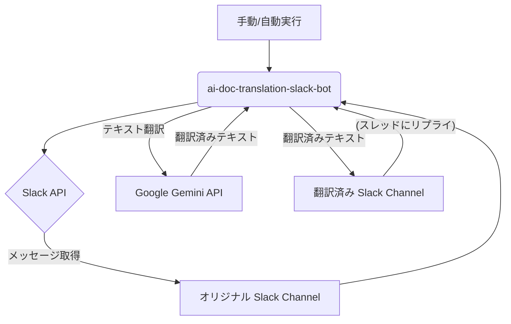

# ai-doc-translation-slack-bot

[英語版はこちら](README.md)

---

## 概要

このボットは、Pythonで実装されており、設定された間隔（デフォルトでは過去24時間）で特定のSlackチャンネルからメッセージを取得します。取得したメッセージはGoogle Gemini APIを使用して日本語に翻訳され、別の指定されたSlackチャンネルに投稿されます。翻訳されたメッセージには、元の投稿へのパーマリンクがスレッド形式で添付されます。

---

## 技術スタック

このプロジェクトは以下の主要な技術を使用しています。

| カテゴリ             | 技術            | 説明                                    |
| :------------------- | :---------------------- | :------------------------------------------- |
| **プログラミング言語** | Python 3.x              | ボットの主要なプログラミング言語。           |
| **Slack連携** | `slack_sdk`             | Slack APIとのインタラクションを処理します。  |
| **AI翻訳** | `google.generativeai`   | Google Gemini APIを介してテキスト翻訳を実行します。 |
| **設定管理** | `python-dotenv`         | `.env`ファイルから環境変数をロードします。   |
| **時間処理** | `pytz`                  | 日時とタイムゾーンの操作に使用します。       |
| **外部API** | Slack API               | メッセージの送受信、パーマリンクの取得に利用します。 |
| **外部API** | Google Gemini API       | テキスト翻訳に利用します。                   |

---

## アーキテクチャ図

このボットの基本的な動作フローを示すアーキテクチャ図です。



---

## セットアップと実行

### 前提条件

* Python 3.x
* Slackワークスペースと、ボットが参加する2つのチャンネル（オリジナルと翻訳済み）
* Slack Bot Token (`SLACK_BOT_TOKEN`)
* Google Gemini API Key (`GEMINI_API_KEY`)

### 環境変数の設定

プロジェクトのルートディレクトリに`.env`ファイルを作成し、以下の情報を記述します。

### インストール

1.  **リポジトリをクローンします**:

    ```bash
    git clone https://github.com/sfyw996/ai-doc-translation-slack-bot.git
    cd ai-doc-translation-slack-bot
    ```

2.  **仮想環境を作成し、アクティベートします**:

    ```bash
    python3 -m venv venv
    source venv/bin/activate  # macOS/Linux
    # venv\Scripts\activate   # Windows
    ```

3.  **必要なパッケージをインストールします**:

    ```bash
    pip install -r requirements.txt
    ```

### 実行

スクリプトを直接実行します。このスクリプトは、実行されるたびに過去24時間のメッセージを処理します。

```bash
python main.py
```

### 今後のアップデート
`cron`やGithub Actionsでの定期実行システムの導入