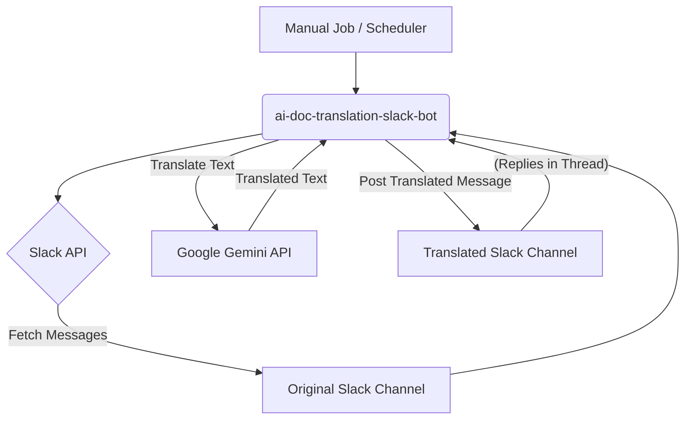

# ai-doc-translation-slack-bot

[日本語版はこちら](README.ja.md)

---

## Overview

This Python-based bot retrieves messages from a designated Slack channel at a configured interval (by default, messages from the last 24 hours are processed). It then uses the Google Gemini API to translate these messages into Japanese and posts the translated content to a separate, specified Slack channel. Each translated message includes a permalink to the original post, presented as a reply in a thread.

---

## Tech Stack

This project utilizes the following key technologies:

| Category               | Technology              | Description/Purpose                                    |
| :--------------------- | :---------------------- | :----------------------------------------------------- |
| **Programming Language** | Python 3.x              | The primary language for the bot's logic.              |
| **Slack Integration** | `slack_sdk`             | Handles all interactions with the Slack API.           |
| **AI Translation** | `google.generativeai`   | Executes text translation via the Google Gemini API.   |
| **Config Management** | `python-dotenv`         | Loads environment variables from a `.env` file.        |
| **Time Handling** | `pytz`                  | Used for datetime and timezone operations.             |
| **External API** | Slack API               | For sending and receiving messages, and retrieving permalinks. |
| **External API** | Google Gemini API       | For text translation.                                  |


---

## Architecture Diagram

Here's a conceptual diagram illustrating the bot's basic operational flow:



---

## Setup and Running

### Prerequisites

* Python 3.x
* A Slack workspace with two channels (one for original messages, one for translated messages) where the bot will operate.
* A Slack Bot Token (`SLACK_BOT_TOKEN`).
* A Google Gemini API Key (`GEMINI_API_KEY`).

### Environment Variables

Create a `.env` file in the root directory of your project and add the following information:
```
SLACK_BOT_TOKEN="xoxb-YOUR_SLACK_BOT_TOKEN"
GEMINI_API_KEY="YOUR_GEMINI_API_KEY"
ORIGINAL_CHANNEL_ID="C1234567890" # The ID of the channel to translate from
TRANSLATED_CHANNEL_ID="C0987654321" # The ID of the channel to post translations to
```

### Installation

1.  **Clone the repository**:

    ```bash
    git clone https://github.com/sfyw996/ai-doc-translation-slack-bot.git
    cd ai-doc-translation-slack-bot
    ```

2.  **Create and activate a virtual environment**:

    ```bash
    python3 -m venv venv
    source venv/bin/activate  # macOS/Linux
    # venv\Scripts\activate   # Windows
    ```

3.  **Install the required packages**:

    ```bash
    pip install -r requirements.txt
    ```

### Execution

Run the script directly. Each execution will process messages from the last 24 hours.

```bash
python main.py
```

### Future Update
Integrate the script with a scheduler like cron or GitHub Actions for continuous operation